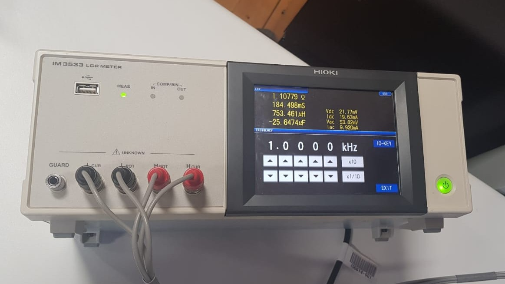
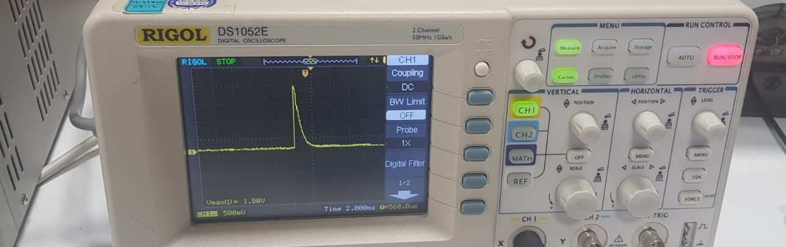

# DC-Motor-Driver Haftalık Rapor 
## [1-7 eylül]
Geçen hafta en son bıraktığımızda bitmiş firmware testleri yapılmıştı, bu testler bazı güvenlik önlemlerini en ince ayrıntılarına kadar test ettiğim deneylerdi, şunlardan oluşuyor.  
** Korumalar **

 - Over-Current Protection
 - UVLO
 - Over-Load Protection
 - Dynamic Over-Load Protection
 - Over-Temperature Protection
 - Field Not Excited
 - Motor Not Connected

Bir problem ile karşılaşılmadı ancak bu testlerde kalibre edilmesi gereken değişkenler olduğu ortaya çıktı. Bunlar sıcaklık sensörü okuması kalibrasyonu ve maksimum akım değeri ve frekans seçimi.

#### Neler Yaptım

Röle kontağı bazen takılı kalıyordu bunun sebebinin rölenin iki ucu arasındaki voltaj farkının 100v olduğu durumda iletime geçmesi ile alakalı olduğunu düşündüm. Temelde deneme yaparken üç faz üzerinden doğrultulan DC kapasitör üzerine düşürülüyor ve sadece röle ile devrenin DC Link kapasitörlerine ulaşıyor, bu yol üzerinde direnç ve endüktans çok düşük olduğu için röle kontakları birbirine dokunduğunda akımılimitleyecek bir yapı yok. Tabii ki devre son durumda jeneratör üzerinden kullanılacakken yolda motorun endüktansı ve direnci olacak (bu model için back emf sabit ve elektriksel olarak da sadece motorun direnci ve endüktansı var gibi modelledim). Denemeleri daha doğru yapabilmek için motordan tekrar ölçüm aldım ancak LCR metre ile doğru ölçüm almak için biraz emek harcadım.  
**değerler**  
- Rdc = 1.10779 ohm  
- L = 753.461 microHenry  
{:height="50%" width="50%"}
** ölçümler 1 kHz ile yapıldı.  
Motor modelini endüktans ve direnç bağlayarak fiziksel ortamda kurdum ve denemelere devam ettim. Rölenin kontaklarının yapışma problemi çözülmüştü ancak biraz daha incelemek istedim. Önce devrenin modelini spice üzerinde kurdum. Sonra röle akımını inceledim ve 150 amper bir anlık akım olduğunu fark ettim. Fiziksel devre üzerinde de ölçüm almaya karar verdim, sonuçlar neredeyse bire bir tutuyordu.  

neredeyse 180 amperlik bir akım geçiyor gözüküyordu, ancak süre çok kısa olduğu için güç değeri düşük bir spike bu (PARALEL KAPASİTOR ATMAYI DENEYEBİLİRİM, SNUBBER GİBİ DAVRANIR)(simulasyon)
  
  
** Firmware **  
- Serial üzerinden hataların gönderilmesi tamamlandı  
- Hatalar giderildi  
- Commentler yazıldı  

** Hardware **  
- Arma elektronik ile iletişime geçildi, profil ve ürün bilgisi alındı  
- 3 Boyutlu modellemeler ile

#### Neler Yapılacak  
** Firmware **  
- Commentlere devam edilecek  
- Serial çıktıları ile ilgili problemler çözülecek  
- Startlama şu an akımı arttırarak yapılıyor, bu bir değişkene bağlanıp süre define edilebilir

 
